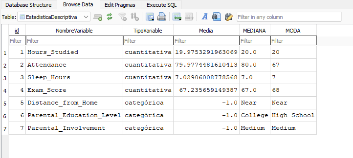

# Tarea Estadística y Exploración de Datos: Medidas de tendencia central

## Consigna
Continuando con lo aprendido en la parte de Estadísticas de la materia (Estadística Descriptiva - Medidas de Posición), aplicar las formulas vistas con el archivo StudentPerformanceFactors.csv (abrir el archivo e ir leyendo las columnas correspondientes de cada fila) y calcular la/s medida/s correspondientes, codigo en Python, sobre las siguientes columnas:
- Hours_Studied
- Attendance
- Sleep_hours
- Exam_score
- Distance_from_home
- Parental_Education
- Parental_Involvement

Crear una tabla llamada "EstadisticaDescriptiva" en SQLite que tenga 5 campos y almacenar allí los resultados de los cálculos:
- NombreVariable
- TipoVariable (numerica ó categorica)
- Media
- Mediana
- Moda

## Resultado en SQLite
